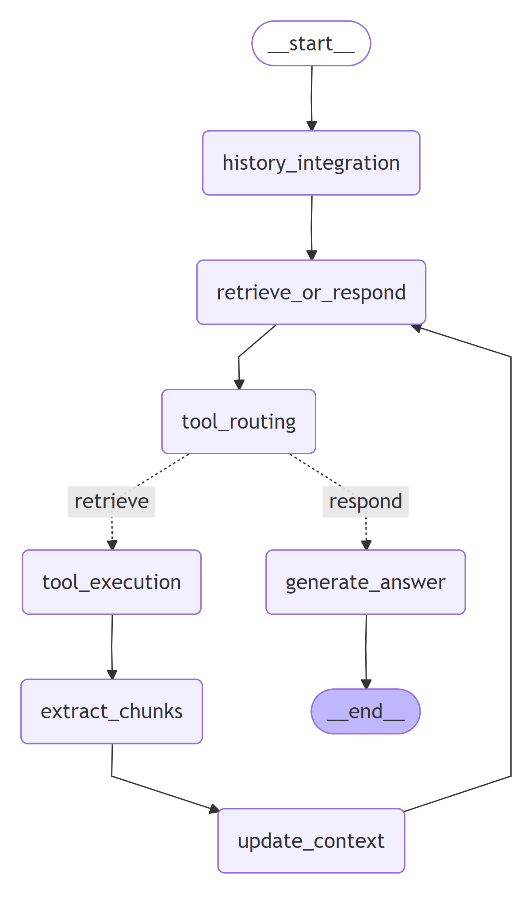
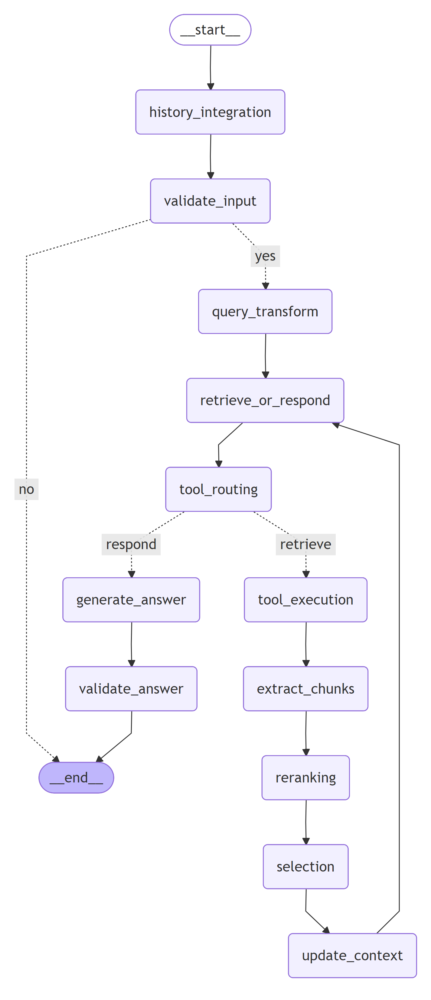

# Advanced Agentic RAG

[](LICENSE)  


A demo project showcasing *Advanced Agentic Retrieval-Augmented Generation (RAG)* systems using **LangGraph**.

---

## Table of Contents

- [Overview](#overview)  
- [Features](#features)  
- [Architecture](#architecture)  
- [Quick Start](#quick-start)  
- [Folder Structure](#folder-structure)  

---

## Overview

This project demonstrates how to build an agentic RAG system with advanced capabilities. It uses **LangGraph** to orchestrate workflows/agents, combining retrieval (from e.g. PDFs or other document sources) and generation.

---

## Features

- Multi-agent or agentic workflows (possible splitting of tasks / controllers)  
- Retrieval from document sources (e.g. PDF)  
- Indexing of documents for fast search / embedding-based retrieval  
- Tool modules for specialized subtasks  
- Configurable via environment variables / config files  

---

## Architecture

Here’s a high-level view of how things are structured:

1. **Document ingestion and indexing** — parsing PDF(s), building embeddings, etc.  
2. **Agent orchestration** using LangGraph — defining workflows or agent pipelines.  
3. **Retrieval + Generation** — given a user prompt, retrieve relevant passages & generate responses.  

### Simple Agentic RAG


### Advanced Agentic RAG


---

## Quick Start

These are basic steps to run the project locally.

### Prerequisites

- Python 3.13 (recommended version)  
- An OpenAI API key or any LLM provider supported  
- Environment with necessary dependencies installed  

### Setup

1. Clone the repo:

   ```bash
   git clone https://github.com/stefano-chen/Advanced_Agentic_RAG.git
   cd Advanced_Agentic_RAG
   ```
2. Copy the example env file and set environment variables:
    ```bash
    cp .env.example .env
    # Then open .env and fill in API keys, etc.
    ```
3. Install requirements:
    ```bash
    pip install -r requirements.txt
    ```
4. Populate/index your documents:
    ```bash
    python populate.py
    ```
5. Start the app:
    ```
    python app.py
    ```

## Folder Structure

Here is a summary of the main folders/files:

| Path           | Description                                               |
| -------------- | --------------------------------------------------------- |
| `app.py`       | Entry-point of the application                            |
| `populate.py`  | Script to load / index documents into retrieval store     |
| `config/`      | Configuration files (app_config, populate_config, prompts)|
| `indexing/`    | Logic for building search indexes              |
| `nodes/`       | Agentic nodes / components defined in LangGraph workflows |
| `pdf/`         | PDF documents used as source material for retrieval       |
| `tools/`       | Auxiliary tools used by agents             |
| `utils/`       | Utility functions/helpers                                 |
| `.env.example` | Template for environment variables                        |
